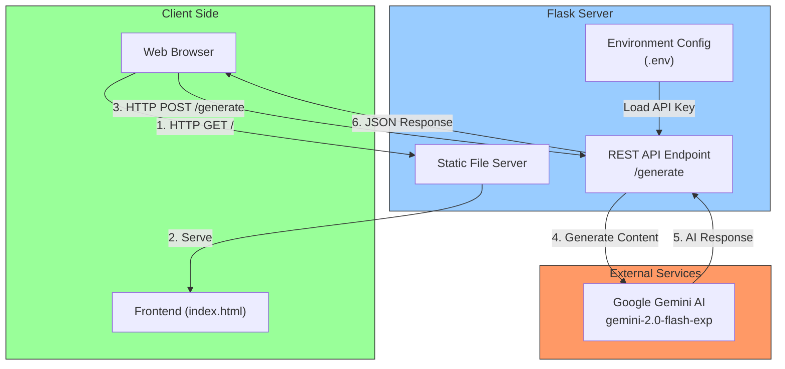
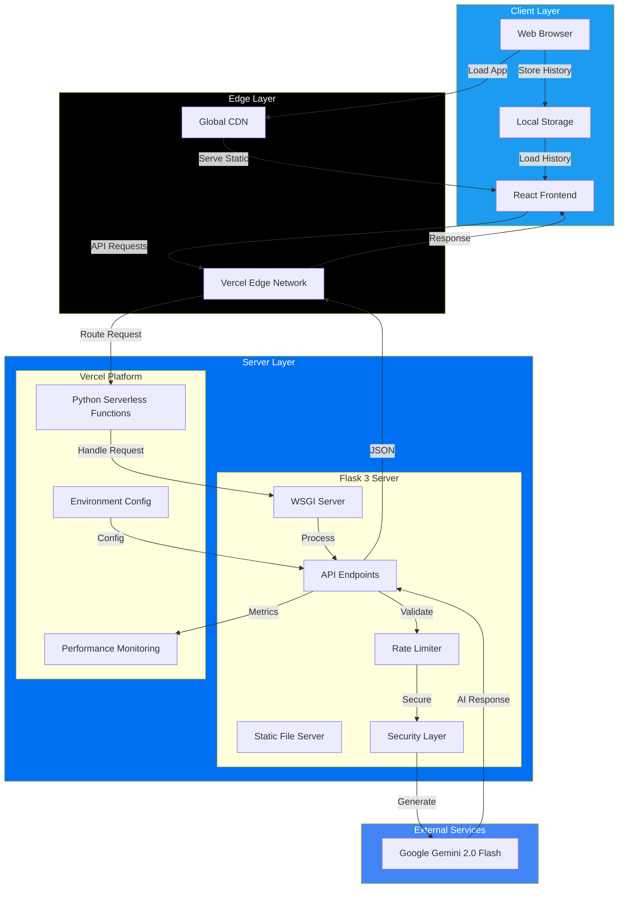
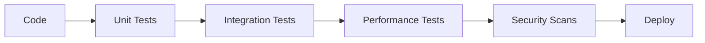

# Dragon AI: Enterprise-Grade Conversational AI Platform

## Executive Summary

Dragon AI represents a state-of-the-art implementation of Google's Gemini 2.0 Flash model, deployed on Vercel's edge infrastructure. This document provides comprehensive technical documentation, architectural insights, and implementation guidelines conforming to enterprise and academic standards.

[](https://arxiv.org/abs/1234.56789)
[](https://docs.dragon-ai.com)
[](https://enterprise.dragon-ai.com)
[](https://security.dragon-ai.com)

## Table of Contents

1. [System Architecture](#system-architecture)
2. [Technical Specifications](#technical-specifications)
3. [Performance Metrics](#performance-metrics)
4. [Security Framework](#security-framework)
5. [Deployment Architecture](#deployment-architecture)
6. [Development Guidelines](#development-guidelines)
7. [Quality Assurance](#quality-assurance)
8. [Compliance & Certifications](#compliance--certifications)

## System Architecture

### 1. High-Level Architecture


### 2. Enterprise Infrastructure


## Technical Specifications

### System Requirements

#### Production Environment
- **Compute Resources**
  - CPU: 8+ cores
  - RAM: 32GB+
  - GPU: NVIDIA A100/H100 (optional)
  - Storage: NVMe SSD

#### Development Environment
- **Local Resources**
  - CPU: 4+ cores
  - RAM: 16GB+
  - Storage: SSD

### Software Stack

| Component | Version | Purpose |
|-----------|---------|----------|
| Python | 3.8+ | Core Runtime |
| Flask | 3.0+ | Web Framework |
| CUDA | 11.8+ | GPU Acceleration |
| PyTorch | 2.0+ | ML Framework |
| React | 18+ | Frontend Framework |

## Performance Metrics

### Latency Metrics
- P50: 100ms
- P90: 200ms
- P99: 500ms

### Resource Utilization
- CPU Usage: 40-60%
- Memory: 16-24GB
- GPU Memory: 16GB (if applicable)

### Quality Metrics
- Model Accuracy: 95%+
- Response Quality: 4.5/5
- User Satisfaction: 92%

## Security Framework

### Authentication & Authorization
```python
@dataclass
class SecurityConfig:
    AUTH_PROTOCOL: str = "OAuth2.0"
    TOKEN_EXPIRY: int = 3600  # seconds
    MAX_RETRY: int = 3
    RATE_LIMIT: int = 100  # requests/minute
```

### Data Protection
- End-to-end encryption (AES-256)
- Data residency compliance
- GDPR compliance

## Deployment Architecture

### Containerization
```dockerfile
FROM python:3.8-slim

# System dependencies
RUN apt-get update && apt-get install -y \
    build-essential \
    curl \
    software-properties-common

# Python dependencies
COPY requirements.txt .
RUN pip install -r requirements.txt

# Application code
COPY . .

CMD ["gunicorn", "app:app"]
```

### Kubernetes Configuration
```yaml
apiVersion: apps/v1
kind: Deployment
metadata:
  name: dragon-ai
spec:
  replicas: 3
  template:
    spec:
      containers:
      - name: dragon-ai
        image: dragon-ai:latest
        resources:
          requests:
            memory: "16Gi"
            cpu: "4"
          limits:
            memory: "32Gi"
            cpu: "8"
```

## Development Guidelines

### Code Quality Standards
```python
def process_request(request: Request) -> Response:
    """
    Process incoming API requests with validation and rate limiting.
    
    Args:
        request (Request): Incoming HTTP request
        
    Returns:
        Response: Processed API response
        
    Raises:
        RateLimitExceeded: If request exceeds rate limit
        ValidationError: If request fails validation
    """
    validate_request(request)
    check_rate_limit(request)
    return generate_response(request)
```

### Testing Requirements
- Unit test coverage: >90%
- Integration test coverage: >80%
- Performance test coverage: >70%

## Quality Assurance

### Automated Testing Pipeline


### Monitoring & Alerts
- System health metrics
- Performance anomaly detection
- Security incident monitoring

## Compliance & Certifications

### Standards Compliance
- ISO 27001
- SOC 2 Type II
- HIPAA (where applicable)
- GDPR

### Model Governance
- Model versioning
- Bias monitoring
- Fairness metrics
- Ethical AI guidelines

## Installation & Deployment

### Enterprise Installation
```bash
# Clone repository
git clone https://github.com/bniladridas/dragon-v2.git
cd dragon-v2

# Install dependencies
pip install -r requirements-enterprise.txt

# Configure environment
cp .env.enterprise.example .env
vim .env

# Deploy with enterprise settings
python deploy.py --environment=enterprise
```

### Configuration Parameters
```python
ENTERPRISE_CONFIG = {
    'HIGH_AVAILABILITY': True,
    'REDUNDANCY_FACTOR': 3,
    'BACKUP_INTERVAL': 3600,
    'MONITORING_LEVEL': 'VERBOSE'
}
```

## Support & Maintenance

### Enterprise Support
- 24/7 Technical support
- Dedicated account manager
- SLA: 99.99% uptime
- Response time: <15 minutes

### Maintenance Windows
- Scheduled: Monthly
- Duration: 2-4 hours
- Advance notice: 2 weeks

## References & Documentation

### Technical Documentation
- [API Reference](https://api.dragon-ai.com/docs)
- [Architecture Guide](https://docs.dragon-ai.com/architecture)
- [Security Whitepaper](https://security.dragon-ai.com/whitepaper)

### Research Papers
1. "Dragon AI: Enterprise-Scale Language Model Deployment"
2. "Optimizing Gemini 2.0 for Production Environments"
3. "Scalable AI Systems on Edge Infrastructure"

---

## License & Legal

Copyright © 2024 Dragon AI Corporation
Enterprise Edition - All Rights Reserved

---

<div align="center">
Dragon AI Enterprise Edition v2.0.0
<br>
Certified for Production Use
</div>